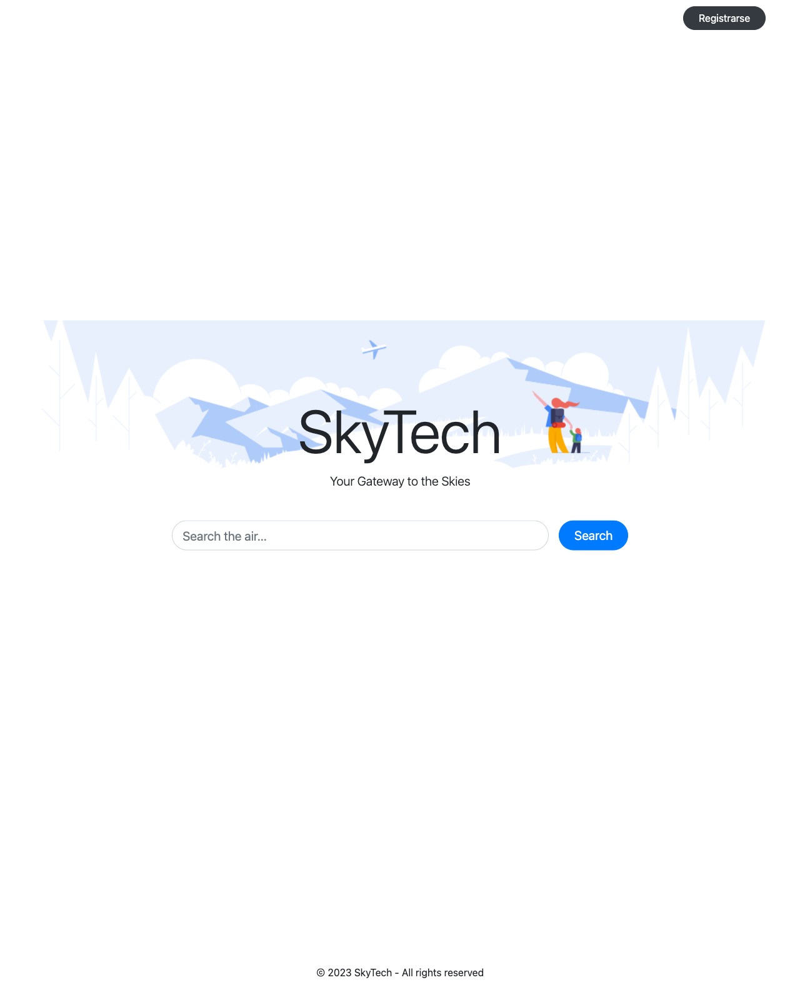

# skytech

> Flight search platform: scrapes LATAM Airlines availability and serves it through a Flask web app with a SQLite database.

University project — runs locally only.

<p align="center">
  
</p>

## ⚠️ Status: archived, not working

This project is **no longer functional** and is preserved for historical / educational purposes only:

- **LATAM blocks scraping.** The site now serves anti-bot challenges that the Selenium driver in `scraper.py` does not handle. The scraper will time out or get redirected.
- **Hardcoded dates.** `run.py` queries flights for `2024-02-03`, which is rejected by the input validation (`departure_date <= today`). Edit the dates in the file to test, but you'll still hit the LATAM block.
- **Old pinned dependencies.** Flask 1.1, SQLAlchemy 1.3 — these only build on **Python 3.11 or earlier**. `cffi==1.16.0` fails to compile on Python 3.13+.

The Flask web app + SQLite layer still runs and is a reasonable reference for a small Flask + Flask-RESTful + SQLAlchemy CRUD project.

## What it does

- **Scraper** (`skytech/scraper.py`) — Selenium-based scraper that queries LATAM's website for round-trip flights between Peruvian cities (Arequipa, Lima, Cusco, etc.). Outputs JSON into `data/`.
- **Web app** (`skytech/database/app.py`) — Flask + Flask-RESTful + SQLAlchemy. Stores flights, users, and saved searches in SQLite. Serves Jinja templates: login, search, results.
- **Driver** (`skytech/run.py`) — orchestrates a scrape and POSTs results into the running web app.

## Stack

Python 3.11 (older pins won't build on 3.13+) · Flask 1.1 · Flask-SQLAlchemy · SQLite · Selenium 4 · ChromeDriver

## Local setup

Selenium requires a Chrome/Chromium browser installed and a matching `chromedriver` on PATH.

```bash
git clone https://github.com/RayverAimar/skytech.git
cd skytech

python3.11 -m venv .venv
source .venv/bin/activate          # Windows: .venv\Scripts\activate

pip install -r requirements.txt
```

> Use Python 3.11 — the pinned `cffi==1.16.0` and `Flask==1.1.2` won't build on Python 3.13+.

## Run

Two processes — start the web app first, then the scraper.

**Terminal 1 — Flask app** (serves on `http://127.0.0.1:5000`):

```bash
cd skytech/database
python app.py
```

**Terminal 2 — scraper + ingest**:

```bash
cd skytech
python run.py
```

`run.py` scrapes Arequipa → Lima for the dates hardcoded inside the file, saves a JSON snapshot in `data/`, and POSTs each flight to `/flight/<id>` on the running Flask app.

## Project layout

```
skytech/
  scraper.py        # LatamScraper — Selenium driver
  run.py            # entry point: scrape + push to API
  config.py         # selenium timeouts
  definitions.py    # city → IATA code map
  utils.py          # shared helpers
  database/
    app.py          # Flask app + REST API + ORM models
    get.py          # query helpers
    templates/      # Jinja templates (login, search, results)
    static/         # CSS, images
```

## Notes

- The committed `database/database.db` is a sample SQLite file from development. Delete it for a clean run — the app will recreate it.
- Flight dates in `run.py` are hardcoded; edit the file to query different routes/dates.
- LATAM's HTML changes periodically — scraper selectors may need updates over time.

## Status

Coursework / archived. Not actively maintained.

## License

MIT
